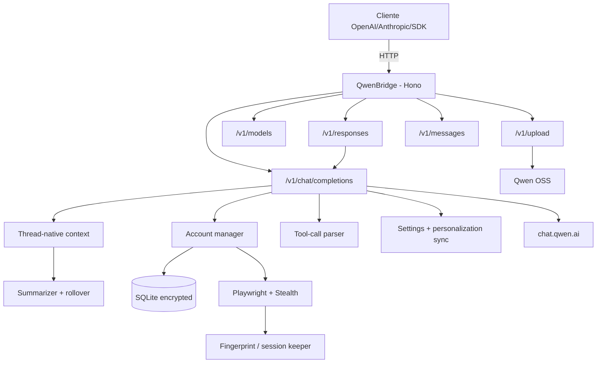

# QwenBridge

API compatível com OpenAI/Anthropic que conecta clientes ao **Qwen (`chat.qwen.ai`)** com suporte a múltiplas contas, tool calling robusto, thread-native, uploads multimodais e sessões persistentes. Inclui Playwright com stealth, retries para erros transitórios, variantes `-no-thinking`/`-thinking`, sumarização de contexto, cache comprimido e observabilidade.

[](https://github.com/johngbl/QwenBridge/actions/workflows/ci.yml)
[](https://www.typescriptlang.org/)
[](https://hono.dev/)
[](LICENSE)

---

## Principais funcionalidades

- **Compatibilidade OpenAI** — `/v1/chat/completions`, `/v1/models`, `/v1/chat/completions/stop`, `/v1/upload` e **Responses API** `/v1/responses`.
- **Compatibilidade Anthropic** — `/v1/messages` e `/v1/messages/count_tokens`.
- **Thread-native** — Reutiliza sessão/pai no Qwen, com sumarização e rollover de contexto.
- **Playwright + stealth** — Headers reais (`bx-ua`, `bx-umidtoken`, `bx-v`) por conta; fingerprint estável e cleanup de processos.
- **Startup rápido multi-conta** — Sobe com a **primeira conta pronta**; as demais continuam preparando em background.
- **Retries resilientes** — 502/503/504, erros de rede (`fetch failed`), anti-bot, quota e `invalid_input` com recriação de chat.
- **Parser de tools robusto** — stream fragmentado, JSON malformado, fuzzy de nomes (`readFile` → `read_file`), JSON duplamente escapado e `</tool_call>` case-insensitive.
- **Personalization sync** — system/tools podem ir por personalization; aplica settings seguras (`largeTextAsFile=false`, memory off, tools internas off).
- **Senhas criptografadas at-rest** no SQLite.
- **Uploads multimodais** — imagens, vídeo, áudio e documentos via OSS do Qwen.
- **Modelos atuais** — família `qwen3.x` + variantes sintéticas `-no-thinking` e `-thinking`.
- **Observabilidade** — `/health`, `/metrics` (Prometheus), watchdog e logs com emojis.
- **Deploy simples** — `npm`, Docker e graceful shutdown.

---

## Arquitetura



---

## Autenticação

Se `API_KEY` estiver definido, as rotas `/v1/*` (e `/metrics`) exigem uma das formas:

- `Authorization: Bearer <API_KEY>` (OpenAI / Responses)
- `x-api-key: <API_KEY>` (Anthropic e clientes mistos)

QwenBridge usa **Playwright por padrão**. Cada conta abre uma sessão real de browser para capturar cookies e headers anti-bot.

```env
PLAYWRIGHT_HEADLESS=true
PLAYWRIGHT_BROWSER=chromium
```

**Requisitos:**

```bash
npx playwright install chromium
```

Senhas das contas são armazenadas **criptografadas** no SQLite (`data/`).

---

## Modelos e contexto

Modelos e janelas de contexto são sincronizados via `/v1/models`. Fallbacks hardcoded antes da primeira sincronização:

| Modelo | Contexto | Divisor de tokens |
|---|---:|---:|
| `qwen3.7-plus` | 1.000.000 | 2.0 |
| `qwen3.7-max` | 1.000.000 | 2.2 |
| `qwen3.6-plus` | 1.000.000 | 2.0 |
| `qwen3.6-plus-preview` | 1.000.000 | 2.0 |
| `qwen3.5-plus` | 1.000.000 | 2.0 |
| `qwen3.5-flash` | 1.000.000 | 1.8 |
| `qwen3-coder-plus` | 1.048.576 | 2.3 |
| `qwen3.6-max-preview` | 262.144 | 2.2 |
| `qwen3.5-max-2026-03-08` | 262.144 | 2.2 |
| `qwen3-vl-plus` | 262.144 | 2.1 |
| `qwen3.5-omni-plus` | 262.144 | 1.8 |
| `qwen3-omni-flash-2025-12-01` | 65.536 | 1.7 |
| `qwen-plus-2025-07-28` | 131.072 | 2.0 |
| **Fallback** | **131.072** | **2.0** |

### Variantes sintéticas

- `-no-thinking` — ex.: `qwen3.7-plus-no-thinking`
- `-thinking` — ex.: `qwen3.7-plus-thinking`

Ambas usam a mesma janela de contexto do modelo base.

---

## Pré-requisitos

| Dependência | Versão mínima | Observação |
|---|---:|---|
| Node.js | 20+ | LTS recomendado |
| npm | 9+ | Incluído com Node |
| Playwright | - | `npx playwright install chromium` |
| Docker | opcional | Deploy em container |

---

## Instalação

### Via npm

```bash
git clone https://github.com/johngbl/QwenBridge.git
cd QwenBridge
npm install
npx playwright install chromium
```

### Via Docker

```bash
docker-compose up -d
```

---

## Início rápido

Crie um `.env` na raiz (use `.env.example` como base).

### Exemplo mínimo

```env
QWEN_ACCOUNTS=user1@example.com:senha1;user2@example.com:senha2
API_KEY=sua-chave-local
HOST=127.0.0.1
```

> **Dica:** use `;` como separador de contas (`,` legado ainda funciona).  
> Senhas com `:`, `#` e espaços são aceitas.

### Iniciar

```bash
npm start
```

### Startup multi-conta

1. Prepara contas em ordem.
2. Quando a **primeira conta** autentica, warm-up ok e **sem cooldown**, o server sobe.
3. As demais continuam em **background** (batch = `PLAYWRIGHT_INIT_BATCH_SIZE`).

Exemplo de log:

```text
🔐 [Server] Preparing first available Qwen account...
✅ [Server] Account ready: us***@example.com
🔄 [Server] Preparing 3 additional account(s) in background...

🚀✨ [Server] Listening on http://127.0.0.1:3000/v1 ✨🚀
```

---

## Testes

```bash
npm test           # mock + live
npm run test:mock  # suite mock (sem browser real de contas)
npm run test:live  # stress/concurrency reais
npm run typecheck  # tipos
```

---

## Variáveis de ambiente

### Rede e segurança

| Variável | Default | Descrição |
|---|---|---|
| `PORT` | `3000` | Porta HTTP |
| `HOST` | `0.0.0.0` | Bind host. Local: `127.0.0.1` |
| `API_KEY` | vazio | Protege `/v1/*` com Bearer token |

### Contas e sessão

| Variável | Default | Descrição |
|---|---|---|
| `QWEN_ACCOUNTS` | vazio | `email1:senha1;email2:senha2` |
| `DELETE_ALL_CHATS_ON_SHUTDOWN` | `false` | Limpa chats no shutdown |
| `QWEN_PERSONALIZATION_FROM_REQUEST` | `true` | Envia system/tools via personalization |
| `QWEN_PERSONALIZATION_VERIFY_GET` | `true` | Confirma personalization com GET |
| `QWEN_CHAT_POOL_SIZE` | `1` | Warm pool de chats por modelo |
| `QWEN_CHAT_POOL_MODELS` | `qwen3.7-plus` | Modelos aquecidos no warm pool |

### Playwright / processos

| Variável | Default | Descrição |
|---|---|---|
| `PLAYWRIGHT_HEADLESS` | `true` | Browser sem janela |
| `PLAYWRIGHT_BROWSER` | `chromium` | `chromium` / `chrome` / `edge` |
| `PLAYWRIGHT_INIT_BATCH_SIZE` | `1` | Contas em paralelo no background init |
| `PLAYWRIGHT_CONTEXT_CLOSE_TIMEOUT_MS` | `10000` | Timeout de close antes do kill |
| `PLAYWRIGHT_IDLE_CONTEXT_TTL_MS` | `600000` | Fecha contextos idle (`0` desativa) |
| `PLAYWRIGHT_JS_HEAP_MB` | `512` | Cap V8 do Chromium (`--max-old-space-size`) |
| `PLAYWRIGHT_LOW_MEMORY_FLAGS` | `true` | Flags de baixa RAM (heap cap, cache mínimo, renderer limit) |
| `OSS_MULTIPART_THRESHOLD_MB` | `5` | Acima disso usa multipart OSS; abaixo `putStream` |
| `SESSION_KEEP_ALIVE_ENABLED` | `false` | Keep-alive opt-in (evita Chromes permanentes) |
| `SESSION_KEEP_ALIVE_INTERVAL_MS` | `180000` | Intervalo do ciclo de keep-alive/cleanup |
| `SESSION_KEEP_ALIVE_IDLE_MS` | `120000` | Idle mínimo para keep-alive |
| `SESSION_KEEP_ALIVE_NAVIGATION_INTERVAL_MS` | `480000` | Intervalo de navegação leve |

### Headers anti-bot

| Variável | Default | Descrição |
|---|---|---|
| `USER_AGENT` | Chrome 149 Windows | UA fallback |
| `QWEN_BX_V` | `2.5.36` | `bx-v` fallback; `bx-ua`/`bx-umidtoken` vêm do browser |

Fingerprint estável por conta (UA, locale, viewport, hardware/WebGL) é aplicado automaticamente.

### Delays e retry

| Variável | Default | Descrição |
|---|---|---|
| `RETRY_BASE_DELAY_MS` | `1000` | Base do exponential backoff |
| `RETRY_MAX_DELAY_MS` | `10000` | Cap do backoff |
| `RETRY_MAX_ATTEMPTS` | `3` | Tentativas por request (create-stream + mid-stream) |
| `RETRY_MAX_ACCOUNT_SWITCHES` | `2` | Máximo de trocas de conta por request |
| `RETRY_ON_UNKNOWN_UPSTREAM` | `true` | Retry/troca automática em erros upstream desconhecidos (denylist só para erros locais terminais) |
| `ANTI_BOT_BASE_DELAY_MS` | `5000` | Base anti-bot |
| `ANTI_BOT_MAX_DELAY_MS` | `30000` | Cap anti-bot |
| `CAPTCHA_SOLVER_ENABLED` | `true` | Recovery anti-bot/TMD no Playwright |
| `CAPTCHA_SOLVER_TIMEOUT_MS` | `25000` | Orçamento total por tentativa de solve |
| `CAPTCHA_SOLVER_MAX_SLIDER_ATTEMPTS` | `2` | Tentativas de drag do slider |
| `CAPTCHA_SOLVER_MIN_INTERVAL_MS` | `20000` | Evita thrash de solve na mesma conta |
| `CAPTCHA_SOLVER_FAIL_COOLDOWN_MS` | `600000` | Cooldown se o solve falhar (10 min) |

### Timeouts

| Variável | Default | Descrição |
|---|---|---|
| `HTTP_TIMEOUT` | `10000` | HTTP genérico |
| `CHAT_TIMEOUT` | `120000` | Timeout de chat |
| `NAVIGATION_TIMEOUT` | `45000` | Navegação Playwright |
| `HEADERS_TIMEOUT` | `60000` | Captura de headers |
| `IDLE_STREAM_TIMEOUT` | `60000` | Stream sem dados |
| `TOTAL_REQUEST_TIMEOUT` | `300000` | Teto de geração |
| `REASONING_MODEL_TIMEOUT` | `600000` | Modelos com reasoning |

**Nota:** timeouts dinâmicos de payload: `120s + 30s por MB`.

### Cache e contexto

| Variável | Default | Descrição |
|---|---|---|
| `CACHE_TTL` | `3600` | TTL do cache (s) |
| `CACHE_COMPRESSION_ENABLED` | `true` | Compressão Brotli |
| `CONTEXT_SUMMARIZATION_ENABLED` | `true` | Sumarização thread-native |
| `CONTEXT_SUMMARIZATION_MODEL` | `qwen3.5-flash` | Modelo de sumarização |
| `CONTEXT_ROLLOVER_ENABLED` | `true` | Rollover de contexto longo |

### Observabilidade

| Variável | Default | Descrição |
|---|---|---|
| `CHAT_REQUEST_LOG` | `false` | Logs detalhados de request |
| `METRICS_INTERVAL` | `10000` | Intervalo de métricas |
| `WATCHDOG_INTERVAL` | `5000` | Intervalo do watchdog |
| `RAM_WARNING` | `80` | % heap warning (`heapUsed / heap_size_limit`) |
| `RAM_CRITICAL` | `95` | % heap critical (`heap_size_limit`, não `heapTotal`) |

---

## Retries e resiliência

O proxy tenta recuperar erros transitórios sem quebrar thread-native/tools:

| Situação | Comportamento |
|---|---|
| `502` / `503` / `504` | Retry com delay curto |
| `fetch failed`, `ECONNREFUSED`, `ETIMEDOUT`, `ENOTFOUND` | Retry de rede |
| Anti-bot (`FAIL_SYS_USER_VALIDATE`, captcha, etc.) | Cooldown + rotação + profile reset em background |
| Quota / rate limit | Cooldown categorizado (`RateLimited`, `RateLimitTemporary`, …) |
| `invalid_input` (“entrada ou anexo inválido”) | Retry forçando **novo chat** + contexto completo |
| Chat not exist / session stale | Força novo chat na sessão lógica |

Settings seguras aplicadas no sync de personalization (sem reescrever tudo da conta):

```json
{
  "ui": { "autoTags": false, "largeTextAsFile": false, "splitLargeChunks": false },
  "mcp_remind": false,
  "memory": { "enable_memory": false, "enable_history_memory": false },
  "tools_enabled": { "web_search": false, "code_interpreter": false }
}
```

---

## Anti-bot

Detecta, entre outros:

- `FAIL_SYS_USER_VALIDATE`
- `RGV587_ERROR`
- mensagens de captcha / human verification

**Fluxo:**

1. Erro detectado → retry com delay
2. Marca cooldown / reseta profile se necessário
3. Rotaciona conta quando faz sentido
4. Se todas falharem → erro ao cliente

Com Playwright, cada conta usa fingerprint e headers capturados do browser real.

**Captcha auto solver (opt-out):** habilitado por padrão (`CAPTCHA_SOLVER_ENABLED=true`). Em anti-bot/TMD (`FAIL_SYS_USER_VALIDATE`, `RGV587`, punish page sufei), o proxy:

1. Reaquece a sessão no Playwright da conta e recaptura `bx-*`
2. Detecta a punish page / `#nocaptcha` (capturas em `network/captcha`)
3. Tenta o slider NoCaptcha de forma humanizada
4. Se limpar o challenge → limpa cooldown e **reusa a mesma conta**
5. Se falhar → cooldown (`CAPTCHA_SOLVER_FAIL_COOLDOWN_MS`) + profile reset + rotação

Não resolve 100% de todos os tipos de captcha visual (puzzle/click complexos), mas cobre o fluxo TMD/sufei-punish mais comum do Qwen/Alibaba.

---

## Compatibilidade real das rotas

O README descreve o uso operacional. Para detalhes técnicos da API (schemas, exemplos, headers), veja:

- [`docs/openapi.yaml`](docs/openapi.yaml) — OpenAPI 3.1 spec com todas as rotas (Chat, Responses, Anthropic, Models, Upload, Health)

> **Nota:** A spec OpenAPI é mantida atualizada com as mudanças recentes (aliases GPT/Claude, auth Bearer + x-api-key, health heap detalhado, endpoints Responses/Anthropic).

---

## Endpoints

### OpenAI Compatible

| Rota | Método | Descrição |
|---|---|---|
| `/v1/chat/completions` | POST | Chat completions (stream + non-stream) |
| `/v1/chat/completions/stop` | POST | Abortar geração |
| `/v1/models` | GET | Listar modelos |
| `/v1/models/:id` | GET | Modelo específico |
| `/v1/responses` | POST | OpenAI Responses API |
| `/v1/responses/:id` | GET | Recuperar response armazenada |
| `/v1/responses/:id` | DELETE | Deletar response |

### Anthropic Compatible

| Rota | Método | Descrição |
|---|---|---|
| `/v1/messages` | POST | Mensagens (formato Anthropic) |
| `/v1/messages/count_tokens` | POST | Contar tokens |

### Utilidades

| Rota | Método | Descrição |
|---|---|---|
| `/health` | GET | Health check |
| `/metrics` | GET | Prometheus (protegido por API key se configurada) |
| `/v1/upload` | POST | Upload multimodal |

---

## Exemplos de uso

### OpenAI SDK (Node.js)

```typescript
import OpenAI from "openai";

const client = new OpenAI({
  baseURL: "http://localhost:3000/v1",
  apiKey: "sua-api-key",
});

const completion = await client.chat.completions.create({
  model: "qwen3.7-plus",
  messages: [{ role: "user", content: "Hello!" }],
});

console.log(completion.choices[0].message.content);
```

### Anthropic SDK

```typescript
import Anthropic from "@anthropic-ai/sdk";

const client = new Anthropic({
  baseURL: "http://localhost:3000",
  apiKey: "sua-api-key",
});

const message = await client.messages.create({
  model: "qwen3.7-plus",
  max_tokens: 1024,
  messages: [{ role: "user", content: "Hello!" }],
});

console.log(message.content[0].text);
```

### cURL

```bash
curl http://localhost:3000/v1/chat/completions \
  -H "Content-Type: application/json" \
  -H "Authorization: Bearer sua-api-key" \
  -d '{
    "model": "qwen3.7-plus",
    "messages": [{"role": "user", "content": "Hello!"}],
    "stream": true
  }'
```

---

## Tool calling

O parser suporta:

- tags `<tool_call>...</tool_call>` (close case-insensitive: `</TOOL_CALL>`)
- formato Hermes/XML (`<parameter name="...">`)
- JSON malformado / recovery (aspas/braces faltando)
- JSON **duplamente escapado** em arguments
- stream fragmentado / tool call sem open tag
- **fuzzy match** seguro de nomes (`readFile` → `read_file`) quando há match único
- tool names não declarados: podem ser preservados como texto literal (evita quebrar exemplos)

Tools internas da conta Qwen (web_search, code interpreter, etc.) ficam desligadas; o proxy usa as tools do cliente.

---

## Model mapping

### Anthropic (Claude → Qwen)

| Claude | Qwen |
|---|---|
| `claude-opus-4-*` | `qwen3.7-max` |
| `claude-sonnet-4-*` | `qwen3.7-plus` |
| `claude-haiku-4-*` | `qwen3.5-flash` |
| `claude-3-5-sonnet` | `qwen3.7-plus` |
| `claude-3-opus` | `qwen3.7-max` |
| `claude-3-sonnet` | `qwen3.6-plus` |
| `claude-3-haiku` | `qwen3.5-flash` |

### Responses API (GPT → Qwen)

| GPT | Qwen |
|---|---|
| `gpt-5` / `gpt-5.5` | `qwen3.7-max` |
| `gpt-5-turbo` | `qwen3.7-plus` |
| `gpt-4.1` / `gpt-4o` | `qwen3.7-plus` |
| `gpt-4.1-mini` / `gpt-4o-mini` | `qwen3.5-flash` |
| `gpt-4` / `gpt-4-turbo` | `qwen3.6-plus` |
| `gpt-3.5-turbo` | `qwen3.5-flash` |

> Modelos **não mapeados** (ex.: `gpt-5-mini` se não existir na tabela) passam “as-is” e o Qwen pode responder `Model not found`. Prefira modelos `qwen*` ou amplie o mapping.

---

## Deploy com Docker

```yaml
services:
  qwenbridge:
    build: .
    container_name: qwenbridge
    ports:
      - "${PORT:-3000}:3000"
    env_file:
      - .env
    volumes:
      - ./data:/app/data
    restart: unless-stopped
    logging:
      driver: "json-file"
      options:
        max-size: "10m"
        max-file: "3"
```

O container ajusta permissões de `data/db` e `data/qwen_profiles` no startup.

---

## Estrutura do projeto

```
QwenBridge/
├── src/
│   ├── api/                 # Server Hono, models, errors
│   ├── benchmarks/          # Baseline de latência do proxy
│   ├── cache/               # Memory cache + Brotli
│   ├── core/                # Config, accounts, DB, metrics, cooldowns
│   ├── routes/
│   │   ├── anthropic/       # API Anthropic
│   │   ├── chat/            # Completions, streaming, account acquire
│   │   └── responses/       # OpenAI Responses API
│   ├── services/
│   │   ├── playwright.ts    # Browser + headers + cleanup
│   │   ├── qwen.ts          # Upstream Qwen + personalization
│   │   ├── session-keeper.ts
│   │   ├── fingerprint.ts
│   │   ├── human-behavior.ts
│   │   └── thread-context-*.ts
│   ├── tools/               # Parser e instruções de tools
│   ├── tests/
│   └── utils/
├── data/                    # SQLite, key e profiles (gitignored)
├── Dockerfile
├── docker-compose.yml
└── package.json
```

---

## Scripts úteis

| Comando | Descrição |
|---|---|
| `npm start` | Iniciar servidor |
| `npm run login` | Gerenciar contas |
| `npm run delete-chats` | Limpar chats Qwen das contas |
| `npm test` | mock + live |
| `npm run test:mock` | Testes mock |
| `npm run test:live` | Testes live/stress |
| `npm run typecheck` | Verificar tipos |
| `npm run benchmark:proxy` | Benchmark de latência |

---

## Troubleshooting

| Problema | Solução |
|---|---|
| Anti-bot / captcha | Solver tenta slider/TMD no browser; se falhar → rotação/profile reset. Desligue com `CAPTCHA_SOLVER_ENABLED=false` |
| Quota exceeded | Mais contas ou esperar cooldown |
| `502 Bad Gateway` / `fetch failed` | Normalmente upstream/rede; o proxy faz retry automático |
| `invalid_input` (anexo inválido) | Retry com chat novo; settings `largeTextAsFile=false` ajudam |
| `Model not found` com `gpt-*` | Aliases (`gpt-5-mini`→flash, `gpt-5`→max, etc.) em Chat/Responses/Anthropic; confira mapping |
| Vários Chromes abertos / RAM alta | `SESSION_KEEP_ALIVE_ENABLED=false`, idle cleanup on, `PLAYWRIGHT_INIT_BATCH_SIZE=1`, `PLAYWRIGHT_JS_HEAP_MB` |
| Watchdog “RAM critical” falso | Já corrigido: usa `heap_size_limit`; confira `/health.heap.usagePercent` |
| Timeout em requests grandes | Aumente `TOTAL_REQUEST_TIMEOUT` / `REASONING_MODEL_TIMEOUT` |
| Playwright não inicia | `npx playwright install chromium` |
| Porta em uso | Altere `PORT` no `.env` |
| Sessão expirada | `npm run login` ou deixe o refresh automático reautenticar |
| API aberta em `0.0.0.0` sem key | Defina `API_KEY` e/ou `HOST=127.0.0.1` |

---

## Disclaimer

Este projeto é fornecido para fins educacionais e de pesquisa. Use por sua conta e risco.
